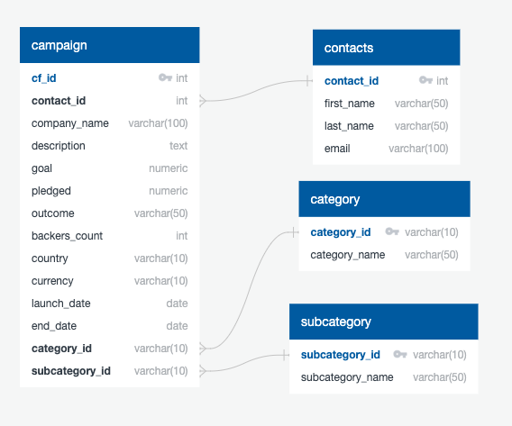
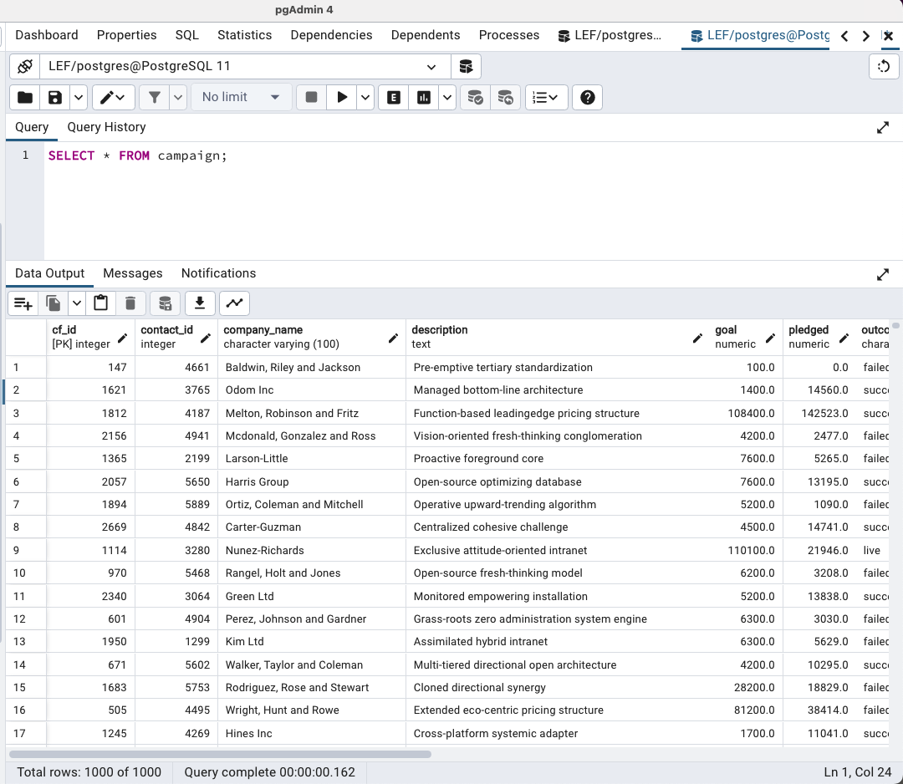
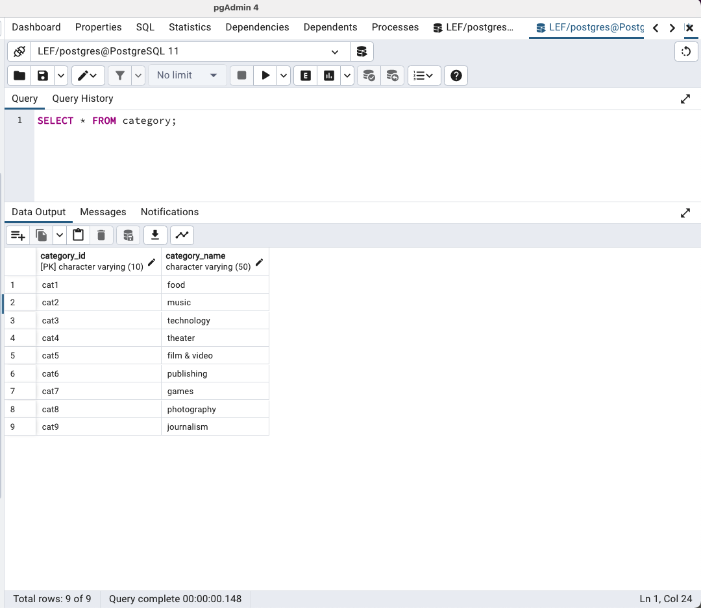
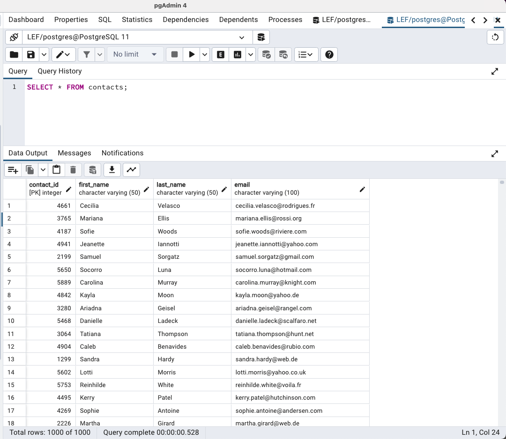
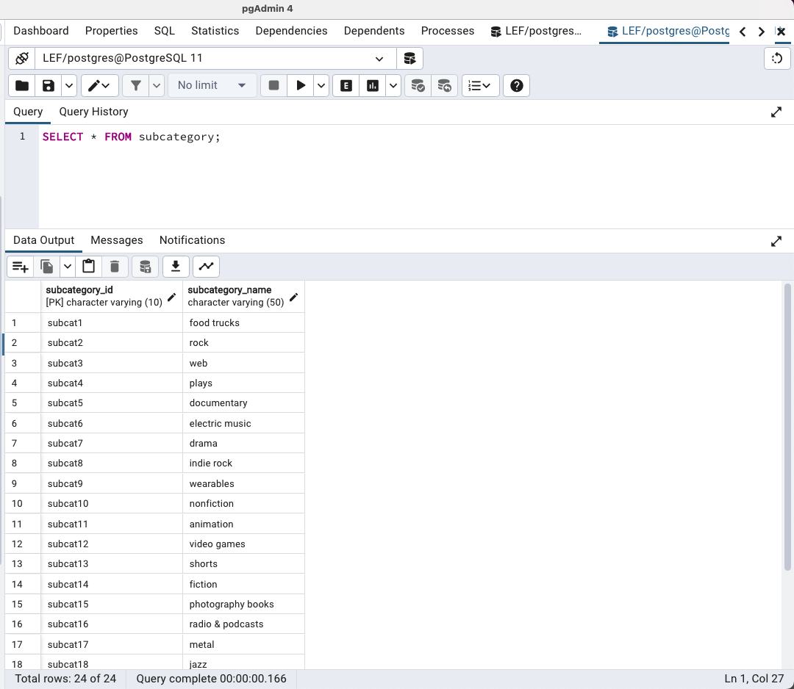

# ETL
***
This project is to practice building an ETL pipeline using Python, Pandas, and either Python dictionary methods or regular expressions to extract and transform the data. After I transformed the data, I created four CSV files and use the CSV file data to create an ERD and a table schema. Finally, I uploaded the CSV file data into a Postgres database.
***

# Extract the crowdfunding.xlsx Data
- Read the data into a Pandas DataFrame
- Create the Category and Subcategory DataFrames
> 1) Create a Category DataFrame that has the following columns:

> 2) A "category_id" column that is numbered sequential form 1 to the length of the number of unique categories.
A "category" column that has only the categories.
Export the DataFrame as a category.csv CSV file.

> 3) Create a SubCategory DataFrame that has the following columns:

> 4) A "subcategory_id" column that is numbered sequential form 1 to the length of the number of unique subcategories.
A "subcategory" column that has only the subcategories.
Export the DataFrame as a subcategory.csv CSV file.

---
# Create a Campaign DataFrame
Create a Campaign DataFrame that has the following columns:
- The "cf_id" column.
- The "contact_id" column.
- The “company_name” column.
- The "blurb" column is renamed as "description."
- The "goal" column.
- The "goal" column is converted to a float datatype.
- The "pledged" column is converted to a float datatype.
- The "backers_count" column.
- The "country" column.
- The "currency" column.
- The "launched_at" column is renamed as "launch_date" and converted to a datetime format.
- The "deadline" column is renamed as "end_date" and converted to a datetime format.
- The "category_id" with the unique number matching the “category_id” from the category DataFrame.
- The "subcategory_id" with the unique number matching the “subcategory_id” from the subcategory DataFrame.
- And, create a column that contains the unique four-digit contact ID number from the contact.xlsx file. 
Then export the DataFrame as a campaign.csv CSV file.
***
# Extract the contacts.xlsx Data.
- Read the data into a Pandas DataFrame. Use the `header=3` parameter when reading in the data.
***
# Create the Contacts DataFrame
Create a Contacts DataFrame that has the following columns:

- A column named "contact_id" that contains the unique number of the contact person.
- A column named "first_name" that contains the first name of the contact person.
- A column named "last_name" that contains the first name of the contact person.
- A column named "email" that contains the email address of the contact person 
Then export the DataFrame as a contacts.csv CSV file.

***
# Data Modeling
First, I checked the CSV file and sketched the ERD as below.

***
## Data Engineering
Based on ERD, a table schema was created considering data types, primary keys, foreign keys and other constraints. Import each CSV file into its corresponding SQL table.

